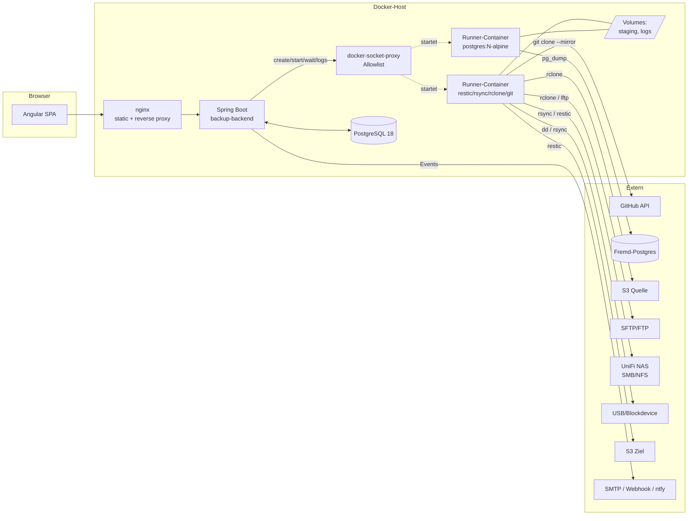
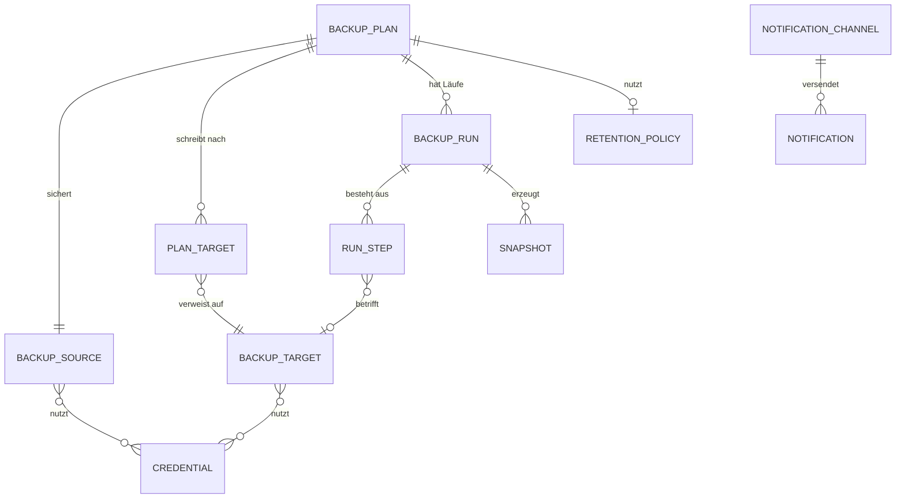
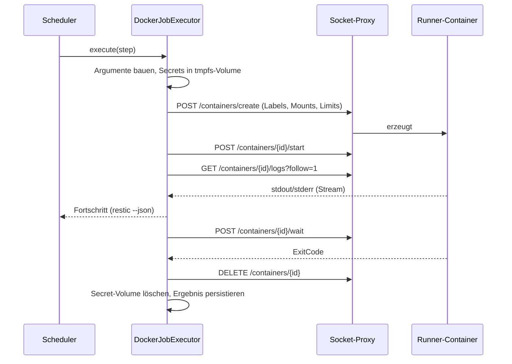

# Konzept: simple-backup

> Status: **Abgestimmt** · Stand: 2026-09-11
> Alle Ausgangsentscheidungen sind getroffen und im Text eingearbeitet — Übersicht in [§14](#14-entscheidungen), Begründungen in den [ADRs](adr/).

---

## 1. Ziel & Abgrenzung

Ein selbst gehostetes Web-Tool, mit dem Backups **zentral definiert, geplant, überwacht und wiederhergestellt** werden. Es erfindet keine eigene Backup-Technik, sondern **orchestriert erprobte Linux-Werkzeuge** (rsync, restic, rclone, pg_dump, git) und liefert das, was diesen Werkzeugen fehlt: Verwaltung, Zeitplanung, Historie, Statusübersicht, Alarmierung und ein Restore-Frontend.

**In Scope**

| Quellen (was gesichert wird) | Ziele (wohin) |
|---|---|
| GitHub-Repositories (inkl. Org/Privat) | Lokale Festplatte / Mount |
| S3-Buckets (AWS & S3-kompatibel) | UniFi NAS (SMB/NFS-Mount oder SFTP) |
| PostgreSQL-Datenbanken | S3 / S3-kompatibel (MinIO, Backblaze B2, Wasabi) |
| FTP / SFTP-Server | SFTP-Server |
| Lokale Ordner & NAS-Shares | |
| Blockdevices / ganze Festplatten | |

**Explizit nicht in Scope (v1)**

- Agent-Software auf den zu sichernden Maschinen (Pull-Modell statt Push-Agents).
- Bare-Metal-Restore von Blockdevices aus der UI heraus (nur Image-Erzeugung + dokumentierter manueller Restore).
- Mandantenfähigkeit / Rollen-Feingranularität `[E-3]`.

**Nicht-funktionale Leitplanken**

- Single-Node-Betrieb auf einem Homeserver muss mit <1 GB RAM für das Backend auskommen.
- Keine Datenverluste durch das Tool selbst: Löschoperationen (Retention/Prune) sind gesondert abgesichert.
- Jedes Backup ist ohne dieses Tool wiederherstellbar. **Kein proprietäres Format, kein Lock-in.** Ein `restic restore` von der Kommandozeile muss immer reichen.

---

## 2. Leitentscheidungen

### 2.1 Zwei-Stufen-Pipeline statt "alles mit rsync"

Der wichtigste Architekturpunkt. `rsync` ist ein exzellenter Datei-Spiegel, aber es kann drei Dinge nicht, die ein Backup-Tool braucht: **Versionierung** (Stand von vor 3 Wochen), **Deduplizierung** und **Verschlüsselung am Ziel**. Und es spricht kein S3.

Deshalb trennen wir **Beschaffung** von **Ablage**:

```
┌──────────────┐        ┌─────────────┐        ┌──────────────┐
│  PRODUCER    │        │   STAGING   │        │   STORAGE    │
│ quellspezif. │ ─────► │  (optional) │ ─────► │  ENGINE      │ ──► Ziel
└──────────────┘        └─────────────┘        └──────────────┘
 pg_dump                 tmpfs / Volume         restic  (Standard)
 git clone --mirror      oder direkt per Pipe   rsync   (Spiegel-Modus)
 rclone (S3/FTP/SFTP)                           rclone  (Sync-Modus)
 rsync / tar
 dd | zstd
```

**Storage-Engine der Wahl: `restic`** *(E-1 entschieden)*

| Kriterium | restic | borg | rsync | rclone |
|---|---|---|---|---|
| S3-Ziel nativ | **ja** | nein (nur via rclone-Umweg) | nein | ja |
| Deduplizierung | **ja** (inhaltsbasiert) | ja | nein | nein |
| Verschlüsselung at rest | **ja** (AES-256, immer) | ja | nein | ja (crypt-remote) |
| Versionierung / Snapshots | **ja** | ja | nein | nein |
| Retention (GFS) eingebaut | **ja** (`forget --keep-*`) | ja | nein | nein |
| Integritätsprüfung | **ja** (`check --read-data`) | ja | nein | nein |
| Software am Ziel nötig | **nein** | ja (borg-Binary) | ja (rsync) | nein |
| Backup aus einer Pipe | **ja** (`--stdin`) | ja | nein | nein |

`restic` gewinnt vor allem an zwei Stellen: S3 direkt (Anforderung „S3 Target") und keine Software auf dem NAS nötig — ein UniFi NAS lässt sich nicht einfach mit einem borg-Binary bestücken.

**`rsync` bleibt** als zweiter, gleichberechtigter Engine-Modus für den Fall „ich will eine 1:1-Kopie, die ich ohne jedes Werkzeug im Dateimanager durchklicken kann" — typisch für den NAS-Ordner oder die USB-Platte im Schrank. Diese Kopie ist unverschlüsselt und unversioniert, und genau das ist manchmal gewollt.

> **Entschieden:** Beide, `restic` als Default. Pro Ziel wird der Modus gewählt: `RESTIC` (versioniert, verschlüsselt, dedupliziert) oder `MIRROR` (rsync/rclone, 1:1, lesbar).

### 2.2 Ein Plan, mehrere Ziele (3-2-1-Regel)

Ein Backup auf genau ein Ziel ist kein Backup. Das Datenmodell bildet deshalb **1 Quelle → N Ziele** ab: Die Quelle wird einmal beschafft, das Ergebnis auf alle konfigurierten Ziele geschrieben. Ein Lauf gilt als `PARTIAL`, wenn das NAS erreichbar war, S3 aber nicht — mit gezielter Alarmierung nur für das fehlgeschlagene Ziel.

### 2.3 Externe Prozesse, nie eine Shell

Alle CLI-Aufrufe laufen über `ProcessBuilder` mit **Argumentliste**, niemals über `sh -c`. Nutzer-Eingaben (Pfade, Hostnamen, Bucket-Namen) landen als einzelne Argumente im Prozess und werden zusätzlich gegen eine Allowlist validiert. Das eliminiert Command-Injection als Angriffsklasse, bevor sie entsteht — bei einem Tool, das per Definition privilegierte Systembefehle ausführt, ist das nicht verhandelbar.

Secrets gehen **nie** als Kommandozeilen-Argument (in `ps` für jeden lesbar), sondern über Umgebungsvariablen des Kindprozesses, `stdin` oder temporäre Dateien mit Modus `0600`.

### 2.4 Modularer Monolith

Ein Deployable, aber innen mit klaren Modulgrenzen (`plan`, `run`, `engine`, `source`, `target`, `secret`, `notification`, `schedule`). Durchgesetzt per **Spring Modulith** — die Modulgrenzen sind dann testbar, nicht nur gut gemeint. Microservices wären für diese Last reine Betriebslast ohne Gegenwert.

---

## 3. Systemarchitektur



Das Backend **berührt die zu sichernden Daten nie selbst.** Es plant, startet, überwacht und protokolliert; die eigentliche Arbeit machen kurzlebige Runner-Container. Das hält das Backend klein und macht den Datenpfad unabhängig vom Anwendungs-Lebenszyklus.

### 3.1 Backend-Module

| Modul | Verantwortung |
|---|---|
| `plan` | Backup-Pläne: Quelle, Ziele, Zeitplan, Retention, Aktivierung |
| `source` | Quell-Adapter (GitHub, Postgres, S3, SFTP, Pfad, Blockdevice) + Verbindungstest |
| `target` | Ziel-Adapter + Erreichbarkeits-/Speicherplatzprüfung |
| `engine` | Prozessausführung: ProcessBuilder, Streaming von stdout/stderr, Timeout, Abbruch, Exit-Code-Interpretation |
| `schedule` | Fällige Pläne finden, Nebenläufigkeit begrenzen, Läufe anstoßen |
| `run` | Lauf-Historie, Schritte, Metriken, Logs, Live-Stream (SSE) |
| `retention` | GFS-Regeln anwenden, Prune, Integritätschecks |
| `restore` | Snapshots browsen, Restore-Aufträge, Restore-Tests |
| `secret` | Verschlüsselte Ablage von Zugangsdaten |
| `notification` | Ereignis → Kanal (SMTP, Webhook, ntfy, Telegram), Dead-Man-Switch |
| `security` | Authentifizierung, Sessions, Audit-Log |

---

## 4. Domänenmodell



**`BackupPlan`** — `name`, `sourceId`, `targets[]`, `cronExpression`, `timezone`, `retentionPolicyId`, `enabled`, `timeoutMinutes`, `maxConcurrent`, `preHook`/`postHook` `[E-4]`, `notifyOn` (`FAILURE` | `ALWAYS` | `NEVER`)

**`BackupSource`** — `type` (Enum), `displayName`, typspezifische Konfiguration als validiertes JSONB, `credentialIds`. JSONB statt Tabelle pro Typ: neue Quelltypen kommen ohne Migration dazu, die Validierung sitzt im Java-Record pro Typ (`@JsonTypeInfo`-Polymorphie, Bean Validation).

**`BackupRun`** — `planId`, `trigger` (`SCHEDULE` | `MANUAL` | `RETRY` | `API`), `status` (`QUEUED` | `RUNNING` | `SUCCESS` | `PARTIAL` | `FAILED` | `CANCELLED` | `TIMEOUT`), `startedAt`, `finishedAt`, `bytesProcessed`, `bytesTransferred`, `filesNew/Changed/Unchanged`, `logPath`, `errorSummary`

**`RunStep`** — `kind` (`PREPARE` | `ACQUIRE` | `TRANSFER` | `VERIFY` | `PRUNE` | `CLEANUP`), `targetId?`, `status`, `exitCode`, `command` (Argumente, Secrets redigiert), Zeiten, Metriken. Die Aufspaltung in Schritte ist das, was `PARTIAL` überhaupt erst darstellbar macht und in der UI sofort zeigt, *wo* es hakte.

**`Snapshot`** — `runId`, `targetId`, `externalId` (restic-Snapshot-ID), `sizeBytes`, `createdAt`, `retentionTag` (`DAILY`/`WEEKLY`/`MONTHLY`/`YEARLY`/`PINNED`). `PINNED` = von Retention ausgenommen, z.B. der Stand vor einer Migration.

---

## 5. Die Quell-Adapter im Detail

### 5.1 Lokale Ordner / NAS-Mounts
- **Producer:** keiner — direkter Pfad.
- **Engine:** `restic backup <pfad> --exclude-file=...` oder `rsync -aHAX --delete`.
- **Hinweis:** Der UniFi-NAS-Share wird auf dem **Host** gemountet (CIFS/NFS) und als Volume in den Container gereicht. Mounten *im* Container bräuchte `CAP_SYS_ADMIN` — vermeidbar, also vermeiden.

### 5.2 PostgreSQL
- **Producer:** `pg_dump -Fc` pro Datenbank + `pg_dumpall --globals-only` für Rollen und Tablespaces (wird gern vergessen und fehlt dann beim Restore).
- **Pipeline:** `pg_dump ... | restic backup --stdin --stdin-filename db.dump` — kein Staging-Plattenplatz nötig, restic dedupliziert trotzdem chunk-basiert.
- **Stolperstein:** `pg_dump` muss **mindestens so neu sein wie der Server**. Bei mehreren Ziel-Servern mit verschiedenen Major-Versionen braucht es mehrere Client-Versionen — gelöst durch das Sidecar-Runner-Modell ([§6](#6-ausführung-sidecar-runner-über-die-docker-api)).
- **Verifikation:** `pg_restore --list` auf dem Dump; schlägt das fehl, ist der Dump korrupt und der Lauf `FAILED`, auch wenn `pg_dump` Exit 0 lieferte.
- **Optional später:** `pg_basebackup` + WAL-Archivierung für Point-in-Time-Recovery.

### 5.3 GitHub
- **Producer:** GitHub-API listet Repos (User, Orgs, Filter nach Topic/Sichtbarkeit/Archiv-Status), dann `git clone --mirror` bzw. `git remote update --prune` in einen persistenten Cache und `git bundle create --all` als Artefakt.
- **Wichtig zu wissen:** Ein Git-Mirror sichert **Code, Branches, Tags, Historie** — aber **nicht** Issues, Pull Requests, Reviews, Releases-Assets, Wiki, Actions-Secrets oder Projektboards. Wer „mein GitHub sichern" sagt, meint meist auch diese Metadaten. Deshalb: zusätzlicher Schritt, der Issues/PRs/Releases über die REST-API als JSON ablegt (+ Wiki als eigenes Git-Repo, das ist es technisch).
- **Rate-Limits:** 5000 req/h authentifiziert; Repo-Discovery wird gecacht, `git`-Operationen zählen nicht gegen das API-Limit.

### 5.4 S3-Buckets
- **Producer:** `rclone sync` in ein Staging-Verzeichnis (oder `rclone copy` direkt zum Ziel im `MIRROR`-Modus).
- **Kostenfalle:** Jeder vollständige Sync liest den Bucket — bei Glacier/Deep-Archive-Klassen teuer und langsam. Default: `--fast-list`, Vergleich über Größe+ModTime statt Checksumme, Speicherklassen-Filter konfigurierbar.
- **Versionierte Buckets:** rclone sichert nur die aktuelle Version. Das muss in der UI stehen, nicht im Kleingedruckten.

### 5.5 FTP / SFTP
- **Producer:** `rclone sync sftp:...` (bevorzugt, einheitliche Konfiguration) oder `lftp mirror` für FTP-Eigenheiten.
- **Sicherheit:** SSH-Hostkey wird beim Anlegen der Quelle erfasst und fest hinterlegt; `StrictHostKeyChecking=yes` gegen eine tool-eigene `known_hosts`. Kein `-o StrictHostKeyChecking=no`, nie.
- Reines FTP (unverschlüsselt) wird unterstützt, aber in der UI als unsicher markiert.

### 5.6 Blockdevices / ganze Festplatten *(umgesetzt)*
- **Producer:** `dd if=/dev/sdX of=<staging>/<name>.img bs=4M` (optional `conv=sparse`), danach sichert restic die Datei wie jede andere.
- **Abweichung vom ersten Entwurf:** Ursprünglich war eine Pipe nach `restic backup --stdin` vorgesehen. Das verträgt sich nicht mit der zweistufigen Pipeline: Ein Plan schreibt auf **mehrere** Ziele, und ein Strom lässt sich nicht zweimal lesen. Die Quelle einmal zu beschaffen und das Ergebnis auf alle Ziele zu schreiben, ist der Kern dieses Entwurfs — der Preis ist Platz im Zwischenverzeichnis, und den nennt die Oberfläche beim Anlegen.
- **Keine Vorkompression:** restic komprimiert selbst. Ein vorher durch `zstd` geschobener Strom wäre für die Deduplizierung nur noch Rauschen — zwei Läufe derselben, kaum veränderten Platte hätten danach nichts mehr gemeinsam.
- **Voraussetzung:** Das Gerät muss in den Container gereicht werden (`devices:` in Compose, lesend) **und** unter `simplebackup.engine.devices` freigegeben sein. Standardmäßig ist die Liste leer: Ohne sie entschiede der Inhalt eines Formularfelds darüber, welche Platte roh gelesen wird. Kein `privileged: true`. Das Dateisystem sollte ausgehängt oder read-only sein, sonst ist das Image inkonsistent.
- **Ehrliche Einordnung:** Image-Backups dedupliziert restic schlecht (ein verschobenes Byte verschiebt alle Chunks — teilweise entschärft durch restics inhaltsbasiertes Chunking). Für „ganze Platte regelmäßig" ist dateibasiertes Backup fast immer die bessere Antwort. Das Tool unterstützt beides und sagt das in der UI.
- **Offen:** `partclone`/`e2image` überspringen freie Blöcke und wären bei ext4/xfs deutlich schneller und kleiner. `dd` ist die Antwort, die für jedes Dateisystem gilt.

---

## 6. Ausführung: Sidecar-Runner über die Docker-API

**Entschieden (E-2): Jeder Backup-Schritt läuft in einem eigenen, kurzlebigen Container.** Das Backend führt selbst keine externen Prozesse aus; es erzeugt Container über die Docker Engine API, wartet auf sie und wertet sie aus.

### 6.1 Warum dieses Modell

- `pg_dump` muss mindestens so neu sein wie der Server. Mit Runnern zieht ein Plan gegen Postgres 16 einfach `postgres:16-alpine`, der nächste `postgres:18-alpine`. Im Ein-Container-Modell wäre das eine Sammlung parallel installierter Client-Versionen.
- Pro Lauf sind **Ressourcen- und Netzgrenzen** setzbar (`memory`, `cpus`, `network`). Ein entlaufener `rclone`-Sync kann das Backend nicht mehr aushungern.
- Tool-Updates (neue restic-Version) sind ein Image-Tag, kein Backend-Deployment.
- **Ein Backend-Neustart killt keinen laufenden Backup-Job.** Die Container laufen weiter, das Backend hängt sich beim Hochfahren wieder an sie an. Im Ein-Prozess-Modell wäre ein 4-Stunden-Lauf verloren.

### 6.2 Der Preis: der Docker-Socket

Wer die Docker-API erreicht, ist auf dem Host faktisch root — er kann einen privilegierten Container mit `/` als Mount starten. Ein Backend mit ungefiltertem Socket-Zugriff macht jede Backend-Schwachstelle zur vollständigen Host-Übernahme. Drei Maßnahmen, gestaffelt:

**1. Socket-Proxy statt Socket (Pflicht).** Das Backend bekommt **nie** `/var/run/docker.sock` gemountet, sondern spricht über HTTP mit einem vorgeschalteten Filter (`tecnativa/docker-socket-proxy` oder eigener minimaler Proxy), der nur durchlässt, was gebraucht wird:

| Erlaubt | Zweck |
|---|---|
| `POST /containers/create` · `/start` · `/wait` · `/kill` | Lauf starten, beenden, Exit-Code holen |
| `GET /containers/{id}/json` · `/logs` · `/json` | Status, Logs, Wiederanlauf-Suche |
| `DELETE /containers/{id}` | Aufräumen |
| `GET /images/json` · `POST /images/create` | Runner-Images prüfen und ziehen |
| `GET /info` | Erkennen, ob der Daemon rootful oder rootless läuft ([§6.2.1](#621-beide-betriebsmodi-unterstützen-e-6-entschieden)) |

Alles andere — `/exec`, `/volumes`, `/networks`, `/build`, `/commit`, Swarm — wird geblockt.

**2. Der Proxy erzwingt Grenzen, nicht das Backend.** Ein Create-Request wird abgelehnt, wenn er `Privileged`, `CapAdd`, `PidMode: host`, `NetworkMode: host` oder einen Bind-Mount außerhalb der Allowlist enthält. Diese Prüfung gehört in den Proxy, weil sie dann auch bei kompromittiertem Backend noch greift. Das Backend validiert zusätzlich — aber Verlass ist auf die äußere Schicht.

**3. Rootless.** Läuft der Docker-Daemon rootless (oder Podman im rootless-Socket-Modus), ist die Eskalation auf den unprivilegierten Docker-Nutzer begrenzt statt auf root.

### 6.2.1 Beide Betriebsmodi unterstützen *(E-6 entschieden)*

Das Tool muss auf rootful **und** rootless Docker laufen. Der Socket-Pfad unterscheidet sich zwar (`/var/run/docker.sock` vs. `$XDG_RUNTIME_DIR/docker.sock`), aber das ist reine Compose-Konfiguration — das Backend spricht ohnehin nur `tcp://dockerproxy:2375`. Drei echte Unterschiede müssen dagegen im Code berücksichtigt werden:

**Modus-Erkennung.** Beim Start liest das Backend `GET /info`; enthält `SecurityOptions` den Eintrag `name=rootless`, läuft der Daemon rootless. Das Ergebnis steuert, welche Funktionen die UI überhaupt anbietet — der Proxy muss `/info` deshalb durchlassen.

**Blockdevices gibt es nur rootful.** Ohne root darf kein Container ein `/dev/sdX` durchgereicht bekommen. Statt den Nutzer nachts mit einem kryptischen Permission-Fehler zu überraschen, wird der Quelltyp „Blockdevice" im rootless-Modus **gar nicht erst angeboten**, mit sichtbarer Begründung. Eine Funktion, die man nicht anlegen kann, ist besser als eine, die beim ersten echten Lauf scheitert.

**User-Namespace-Mapping.** Rootless Docker bildet Container-UIDs über `subuid`/`subgid` auf andere Host-UIDs ab. Eine Datei, die dem Host-Nutzer gehört, ist im Runner unter Umständen nicht lesbar — und das fällt sonst erst beim ersten nächtlichen Lauf auf. Zwei Konsequenzen:

- UID/GID des Runners sind über `PUID`/`PGID` konfigurierbar; das Tool nimmt nirgends eine feste UID an.
- Der **Verbindungstest einer Quelle läuft im Runner-Container**, nicht im Backend. Nur so testet man die Rechte, die später tatsächlich gelten. Ein Test, der im Backend grün ist und im Runner rot, wäre schlimmer als kein Test.
- Ownership-erhaltendes `rsync -a` funktioniert rootless nur innerhalb des Mappings. Im Mirror-Modus wird das erkannt und dokumentiert statt still falsche Eigentümer zu schreiben.

### 6.3 Ablauf eines Schritts



**Labels** (`simple-backup.run-id`, `.step-id`, `.managed-by`) machen jeden Container eindeutig zuordenbar — Grundlage für Wiederanlauf und für den Reaper, der beim Start verwaiste Container einsammelt.

**`AutoRemove` bleibt aus.** Ein automatisch entfernter Container nimmt Exit-Code und Logs mit ins Grab. Entfernt wird erst, nachdem das Ergebnis in der Datenbank steht.

### 6.4 Mounts: woher weiß das Backend die Host-Pfade?

Der Knackpunkt des Modells. Das Backend sieht `/sources/photos`; der Runner braucht aber den **Host**-Pfad `/srv/photos`, denn der Docker-Daemon löst Bind-Mounts gegen das Host-Dateisystem auf.

Lösung: **Self-Inspection.** Das Backend fragt beim Start `GET /containers/{eigene-id}/json` ab und liest die eigene Mount-Tabelle (`Source` = Host-Pfad, `Destination` = Container-Pfad). Daraus entsteht eine Übersetzungstabelle, mit der jeder Container-Pfad in den korrekten Host-Pfad umgerechnet wird. Kein doppelt gepflegter Pfad-Katalog, keine Konfiguration, die beim ersten Compose-Umbau still falsch wird.

Pfade, die sich damit nicht auflösen lassen, werden **abgelehnt** statt geraten — ein Backup, das ins Leere greift, muss beim Anlegen scheitern, nicht nachts um drei.

Named Volumes (Staging, Logs) werden einfach unter demselben Namen in den Runner gehängt.

### 6.5 Secrets in den Runner

Umgebungsvariablen scheiden aus: Sie stehen in der Container-Konfiguration und sind über
`docker inspect` lesbar, solange der Container existiert. Kommandozeilen-Argumente ebenso —
die sieht jeder in `ps`.

Stattdessen werden die Werte über `PUT /containers/{id}/archive` als Dateien mit Modus `0600`
nach `/run/secrets` gelegt, **bevor** der Container startet. Der Runner liest sie über
Datei-Referenzen (`--password-file`, `AWS_SHARED_CREDENTIALS_FILE`, `PGPASSFILE`, SSH-Key-Datei)
— restic, rclone und psql unterstützen das alle nativ. Mit `docker rm`, das nach jeder
Auswertung läuft, verschwindet die Schreibschicht und mit ihr die Datei.

> **Abweichung vom ursprünglichen Entwurf.** Geplant war ein `tmpfs`, damit die Werte nur im
> RAM stehen. Das lässt sich mit der Docker-API nicht sauber verbinden: Ein `tmpfs` wird erst
> beim Start gemountet und überdeckt alles, was vorher hineinkopiert wurde; kopiert man erst
> nach dem Start, läuft das Kommando bereits. Ein Umweg über ein wartendes Entrypoint-Skript
> würde nur für das eigene Runner-Image funktionieren, nicht für `postgres:N-alpine`.
>
> Der entscheidende Gewinn bleibt: Die Werte stehen **nicht** in `docker inspect`, **nicht**
> in `ps` und **nicht** in der Container-Konfiguration. Der Preis ist, dass sie kurzzeitig die
> Schreibschicht des Containers berühren statt ausschließlich den Arbeitsspeicher.

### 6.6 Runner-Images

| Image | Inhalt | Verwendung |
|---|---|---|
| `simple-backup-runner` | restic, rsync, rclone, git, openssh-client, zstd, partclone | Standard für alle Datei- und Storage-Schritte |
| `postgres:16\|17\|18-alpine` | pg_dump, pg_dumpall, pg_restore, psql | Postgres-Quellen, Version passend zum Server |

Die Images sind über einen Tag gepinnt (nie `:latest`), werden beim Backend-Start auf Vorhandensein geprüft und bei Bedarf gezogen. Ein Homeserver ohne Internet muss trotzdem sichern können — deshalb Prüfung **vorab** und eine klare Fehlermeldung, kein Pull-Versuch mitten im Lauf.

### 6.7 Abstraktion trotzdem

`DockerJobExecutor` ist die einzige Produktiv-Implementierung, aber das `BackupExecutor`-Interface bleibt — mit einem `LocalProcessExecutor` für Unit-Tests und lokale Entwicklung ohne Docker-Daemon. Tests, die für jeden Fall einen Container hochziehen, sind zu langsam, um sie oft laufen zu lassen; Tests, die man nicht oft laufen lässt, findet niemand nützlich. Die Integrationstests nutzen dann Testcontainers gegen echtes Docker.

### 6.8 Scheduling

Kein Quartz. Stattdessen ein **Datenbank-Poller**: alle 30 s prüft ein `@Scheduled`-Task, welche Pläne fällig sind, und übernimmt sie mit

```sql
SELECT ... FROM backup_plan WHERE next_run_at <= now() AND enabled
FOR UPDATE SKIP LOCKED LIMIT 10
```

Das ist mehrinstanzen-sicher, überlebt Neustarts, braucht keine zusätzliche Bibliothek und keine elf Quartz-Tabellen. Cron-Ausdrücke per `CronExpression` aus Spring, Zeitzone pro Plan (Sommerzeit korrekt). Verpasste Läufe (Server war aus): konfigurierbar `SKIP` (Default) oder `CATCH_UP`.

Begrenzung der Nebenläufigkeit: global (`maxParallelRuns`, Default 2), pro Ziel (ein restic-Repository verträgt keine parallelen `prune`-Operationen) und pro Plan (nie zweimal gleichzeitig).

### 6.9 Lauf-Lebenszyklus

```
QUEUED → RUNNING → ┬→ SUCCESS      (alle Schritte ok)
                   ├→ PARTIAL      (≥1 Ziel ok, ≥1 Ziel fehlgeschlagen)
                   ├→ FAILED       (Beschaffung fehlgeschlagen oder alle Ziele down)
                   ├→ TIMEOUT      (Zeitlimit überschritten, Container gekillt)
                   └→ CANCELLED    (Nutzerabbruch)
```

- **Live-Logs:** Der Container-Log-Stream wird zeilenweise gelesen, nach `logs/{runId}.log` geschrieben und per **SSE** an die UI gestreamt. Logs gehören nicht in die Datenbank — nur Pfad und Kurzfassung des Fehlers.
- **Fortschritt:** `restic --json` liefert strukturierten Fortschritt (Prozent, Bytes, ETA), `rsync --info=progress2` ebenfalls — beides wird geparst und als Fortschrittsbalken angezeigt.
- **Abbruch:** `POST /containers/{id}/kill` (SIGTERM, nach 10 s SIGKILL), danach Aufräumen von Staging und `restic unlock`.
- **Wiederanlauf nach Backend-Neustart:** Container mit `simple-backup.run-id`-Label suchen. Läuft er noch → wieder anhängen und weiterverfolgen. Ist er beendet → Exit-Code auswerten und den Lauf korrekt abschließen. Nur wirklich verwaiste Läufe werden auf `FAILED` gesetzt.
- **Retry:** exponentieller Backoff, konfigurierbar (Default 2 Versuche), nur bei als transient klassifizierten Fehlern (Netz, Timeout) — nicht bei Exit-Codes, die auf Fehlkonfiguration deuten.

## 7. Aufbewahrung, Prüfung, Wiederherstellung

### 7.1 Retention (GFS)
`restic forget --keep-last N --keep-daily 7 --keep-weekly 4 --keep-monthly 12 --keep-yearly 3 --prune`

Zwei Schutzmechanismen gegen Datenverlust durch das Tool selbst:
1. **Dry-Run-Pflicht bei Änderungen:** Wird eine Retention-Regel verschärft, zeigt die UI vorher, welche Snapshots das löschen würde — und verlangt eine Bestätigung.
2. **Prune läuft getrennt vom Backup.** Ein Backup, das am Prune scheitert, hat trotzdem gesichert. Prune ist ein eigener, seltener Lauf (z.B. wöchentlich).

### 7.2 Integritätsprüfung
Ein ungeprüftes Backup ist eine Vermutung. Als eigener Plantyp:
- `restic check` (Struktur, schnell) — wöchentlich
- `restic check --read-data-subset=5%` (echte Daten, liest 5 % zufällig) — monatlich
- **Restore-Test:** Stichprobe automatisch in ein Temp-Verzeichnis wiederherstellen, Prüfsummen vergleichen, wieder verwerfen. Ergebnis als grünes/rotes Abzeichen am Ziel. Das ist das Feature, das im Ernstfall den Unterschied macht.

### 7.3 Restore
- Snapshots pro Ziel browsen (`restic snapshots --json`, Dateibaum via `restic ls`).
- Restore in einen wählbaren Zielpfad, optional nur einzelne Pfade.
- Einzelne Datei direkt im Browser herunterladen (gestreamt via `restic dump`).
- Postgres: Dump herunterladen **oder** geführter Restore in eine Ziel-DB (mit doppelter Bestätigung und Pflichtfeld „Zieldatenbank" — versehentliches Überschreiben der Produktion muss schwer sein).
- Restore-Läufe landen in derselben Historie und werden auditiert.

---

## 8. Status & Benachrichtigung

### 8.1 Dashboard
- Kachel je Plan: letzter Lauf (Ampel), Dauer, Größe, nächster Lauf, Sparkline der letzten 30 Läufe.
- Globale Ampel oben: „alles grün" / „N Pläne rot" / „N überfällig".
- Speicherbelegung je Ziel inkl. Trend — freier Platz ist der Grund Nr. 1 für plötzlich fehlschlagende Backups.

### 8.2 Kanäle *(entschieden: Pushover)*

**Pushover** ist der primäre Kanal. Die API ist ein einzelner HTTP-POST an `api.pushover.net/1/messages.json` mit App-Token und User-Key — beides landet in der verschlüsselten Secret-Ablage.

Der entscheidende Vorteil gegenüber anderen Push-Diensten ist die **Emergency-Priorität** (`priority=2`): Pushover wiederholt die Meldung in einem konfigurierbaren Intervall, bis sie auf dem Gerät **quittiert** wird. Genau das braucht ein fehlgeschlagenes Backup — eine Push-Nachricht, die man morgens um sieben verschlafen wegwischt, hat ihren Zweck verfehlt. Die Prioritätszuordnung:

| Ereignis | Priorität |
|---|---|
| `RUN_FAILED`, `VERIFY_FAILED`, `RETENTION_WOULD_DELETE_ALL` | `2` — Emergency, Quittierung erforderlich |
| `RUN_PARTIAL`, `PLAN_OVERDUE`, `TARGET_UNREACHABLE`, `STORAGE_LOW` | `1` — hoch, umgeht Ruhezeiten |
| `RUN_SUCCESS` (optional), Erholungsmeldungen | `-1` — leise |

Pushovers Kontingent liegt bei 10.000 Nachrichten pro Monat und App. Der Rest wird im Antwort-Header `X-Limit-App-Remaining` mitgeliefert, ausgewertet und als Metrik geführt — ein aufgebrauchtes Kontingent legt sonst stillschweigend die gesamte Alarmierung lahm.

**Ebenfalls in v1: der generische Webhook.** Nicht weil du ihn angefragt hättest, sondern weil die Kanal-Abstraktion ohnehin entsteht und ein JSON-POST an eine frei wählbare URL danach etwa dreißig Zeilen kostet. Damit hängst du später n8n, Home Assistant oder Gotify an, ohne dass jemand Code anfassen muss.

**Ein Hinweis, keine Forderung:** Ein einziger Alarmkanal ist selbst ein Single Point of Failure — Kontingent aufgebraucht, Account-Problem, Dienst gestört. Der externe Dead-Man-Switch aus §8.3 federt das ab, weil er unabhängig von diesem Tool und von Pushover alarmiert. Solltest du später doch einen zweiten Kanal wollen, ist SMTP die naheliegende Ergänzung; die Architektur hält den Platz dafür frei.

Weitere Kanäle (SMTP, ntfy, Telegram, Slack) sind über dieselbe Schnittstelle nachrüstbar und stehen nicht im Weg, solange sie niemand konfiguriert.

**Zustellung robust:** Benachrichtigungen laufen über eine Outbox-Tabelle mit Wiederholung. Eine Alarmmeldung, die selbst verloren geht, ist schlimmer als keine.

**Anti-Spam:** Wiederholte Fehler desselben Plans werden zusammengefasst (erster Fehler sofort, danach gedrosselt), plus eine Meldung beim Wiedererholen („Plan X läuft wieder"). Emergency-Meldungen werden nach der Quittierung nicht erneut eskaliert, solange sich der Zustand nicht ändert.

### 8.3 Dead-Man-Switch — das wichtigste Monitoring-Feature

Der gefährlichste Zustand ist nicht das fehlgeschlagene Backup, sondern das **ausgebliebene**: Container tot, Host aus, Scheduler hängt — und es kommt nie eine Fehlermeldung, weil nichts läuft, das eine senden könnte.

Zwei Ebenen:
1. **Intern:** Ein Wächter prüft, ob jeder Plan innerhalb `erwartetes Intervall × 1,5` gelaufen ist, und schlägt sonst Alarm (`PLAN_OVERDUE`).
2. **Extern:** Das Tool pingt nach jedem erfolgreichen Lauf einen externen Dienst (healthchecks.io oder selbst gehostet). Bleibt der Ping aus, alarmiert **der** — auch wenn dieses Tool komplett tot ist. Optional, aber dringend empfohlen.

### 8.4 Metriken
Micrometer → `/actuator/prometheus`: Lauf-Dauer, Erfolgsquote, Bytes, Alter des jüngsten Snapshots pro Plan, Zielbelegung. Wer Grafana hat, hat sofort Dashboards und Alerting.

---

## 9. Sicherheit

### 9.1 Zugangsdaten
Zu schützen: GitHub-PATs, S3-Keys, SSH-Keys, DB-Passwörter, restic-Repository-Passwörter, SMTP-Zugänge.

- **Verschlüsselung:** AES-256-GCM pro Datensatz mit Envelope-Verfahren; Masterkey aus Umgebungsvariable bzw. Docker Secret, **nie in der Datenbank**. Schlüsselrotation über `keyVersion` je Datensatz.
- **API:** Secret-Felder sind schreib-only. Die API gibt nie einen Klartextwert zurück, auch nicht an Admins.
- **Logs:** Ein zentraler Redaktor filtert bekannte Secret-Werte und typische Muster (`ghp_…`, `AKIA…`) aus allen Logzeilen und gespeicherten Kommandos, bevor sie geschrieben werden.
- **Backup des Tools selbst:** Ohne Masterkey ist die eigene Datenbank wertlos. Ein geführter „Konfiguration exportieren"-Ablauf (passwortgeschütztes Archiv) gehört ins v1 — sonst ist der erste echte Ernstfall zugleich der letzte.

### 9.2 Authentifizierung *(E-3 entschieden)*
- **Entschieden:** Spring Security mit **Session-Cookie** (`HttpOnly`, `Secure`, `SameSite=Lax`) statt JWT im LocalStorage. Weniger Code, kein XSS-Token-Diebstahl, sofortiger Logout möglich. JWT löst hier ein Problem, das niemand hat.
- Passwort-Hash Argon2id, Brute-Force-Bremse, Pflicht-Passwortwechsel beim ersten Login.
  Der Zwang wird **im Backend** durchgesetzt, nicht in der Oberfläche: Solange das Erstpasswort gilt,
  beantwortet die API nur Sitzungsabfrage, Passwortwechsel und Abmelden — sonst reichte das einmalig
  protokollierte Startpasswort für einen `curl`-Aufruf an der Oberfläche vorbei.
- TOTP-2FA als kleines, lohnendes Extra.
- **OIDC** (Authelia/Keycloak/Authentik) als zweiter Anmeldeweg, eingeschaltet über das Profil `oidc`.
  Ohne konfigurierten Anbieter existiert der Weg gar nicht — kein Knopf, der ins Leere führt.
  Der Anbieter sagt, **wer** jemand ist; was er darf, entscheidet diese Anwendung: Wer sich zum
  ersten Mal anmeldet, bekommt Leserechte. Administrator wird niemand allein dadurch, dass er
  sich anmeldet. Ist eine Administratorgruppe konfiguriert, folgt die Rolle dem Anbieter — auch
  nach unten, denn wem dort die Gruppe entzogen wurde, der darf hier nicht Administrator bleiben.
  Ein in dieser Anwendung abgeschaltetes Konto kommt auch über diesen Weg nicht herein.
- Rollen v1: `ADMIN` (alles) und `VIEWER` (nur lesen). Mehr erst, wenn jemand mehr braucht.

### 9.3 Härtung
- Backend- und Runner-Container laufen als Nicht-Root. Blockdevice-Zugriff wird pro Lauf über `Devices` im Create-Request gewährt und vom Socket-Proxy gegen eine Allowlist geprüft — nie `privileged`.
- Quell-Mounts read-only (`:ro`) — das Tool hat auf den Quelldaten nichts zu schreiben.
- Audit-Log für jede verändernde Aktion (wer, was, wann, von wo).
- Keine Ausgabe nach außen ohne Kontext: Fehlermeldungen an die UI sind bereinigt, Details stehen im Log.
- Die Oberfläche lädt nichts aus dem Internet nach. Schriften und Symbole liegen im eigenen Bundle;
  ein Werkzeug, das im abgeschotteten Netz laufen soll, darf nicht von einem CDN abhängen — und die
  Browser der Benutzer haben dabei auch nichts bei Dritten zu melden.

---

## 10. Technologie-Stack (verifiziert, Stand 2026-09-11)

### Backend
| Baustein | Version | Begründung |
|---|---|---|
| Java | **25 (LTS)** | aktuelles LTS, virtuelle Threads ohne Pinning |
| Spring Boot | **4.1.1** | aktuelles Release (Spring Framework 7) |
| PostgreSQL | **18** | JSONB für Adapter-Konfiguration, `SKIP LOCKED` für den Scheduler |
| Flyway | aktuell | versionierte Migrationen ab Commit 1 |
| Spring Modulith | aktuell | Modulgrenzen testbar statt nur dokumentiert |
| springdoc-openapi | aktuell | OpenAPI-Spec → generierter Angular-Client |
| Micrometer | mitgeliefert | Prometheus-Metriken |
| Testcontainers | aktuell | Integrationstests gegen echtes Postgres/MinIO/SFTP |

Virtuelle Threads passen hier ausgesprochen gut: Ein Backup-Lauf ist zu 99 % Warten auf einen Kindprozess. Ein Thread pro Lauf ist das einfachste Modell — mit virtuellen Threads ist es auch das billigste, kein Reactive-Programmiermodell nötig.

### Frontend *(E-5 entschieden)*

| Baustein | Version | Begründung |
|---|---|---|
| Angular | **22.1** | Standalone Components, Signals, `@if`/`@for`, Zoneless |
| TypeScript | passend zum Angular-Release | `strict` von Anfang an |
| Angular Material + CDK | **22.1** | Komponenten vom Angular-Team, gleicher Release-Tag wie das Framework, beste Barrierefreiheit |
| Tailwind CSS | **4.3** | Layout, Abstände, Typografie — alles außerhalb der Material-Komponenten |
| Charts | **eigenes Inline-SVG** | Für Sparklines und einen Speicher-Trend lohnt keine Chart-Bibliothek |
| State | Signals + Services | NgRx wäre für diese Größe Overhead |
| API-Client | aus OpenAPI generiert | keine handgeschriebenen DTOs, Brüche fallen beim Build auf |
| Tests | Vitest + Playwright | |

**Material und Tailwind sauber kombinieren.** Die Kombination funktioniert gut, aber nur mit einer klaren Grenze — sonst kämpfen zwei Styling-Systeme um dieselben Elemente:

- **Tailwind nur auf eigenen Elementen.** Layout, Grid, Abstände, Typografie. Material-Komponenten werden **nicht** mit Utility-Klassen überschrieben, sondern über Material-3-Tokens (`--mat-*`) gethemt. Wer `class="p-2 bg-white"` auf ein `<mat-form-field>` schreibt, hat beim nächsten Material-Update ein Problem.
- **Preflight kontrollieren.** Tailwinds Basis-Reset setzt unter anderem Rahmen und Hintergründe zurück und kollidiert damit an Rändern mit Material. Tailwind 4 erlaubt es, die Layer-Reihenfolge explizit zu setzen; Material-Styles gehören hinter Preflight, aber vor die Utilities.
- **Ein Ort für Farben.** Die Material-3-Palette ist die Quelle der Wahrheit; die Tailwind-Konfiguration leitet ihre Farben aus denselben CSS-Custom-Properties ab. Zwei getrennt gepflegte Paletten driften garantiert auseinander — besonders im Dark Mode.

**Was wir dafür selbst bauen.** Material hat keine TreeTable. Der Snapshot-Browser (Baum aus Verzeichnissen mit Spalten für Größe und Datum, nachgeladen pro Ebene) entsteht aus `cdk-tree` plus `cdk-virtual-scroll-viewport`. Das ist die größte Einzelaufgabe im Frontend und ist in M4 als solche eingeplant, nicht als Nebenbei-Arbeit. Die Lauf-Historie nutzt `MatTable` mit eigener Filterleiste und Zeilenaufklappung für die Schritte.

### Build & CI *(E-5 entschieden)*

- **Maven** für das Backend (`mvnw` im Repo, damit CI und Entwicklungsrechner dieselbe Version nutzen), Angular-Build als eigener Schritt, im Release-Image zusammengefügt.
- GitHub Actions: Build → Test → Lint → Container-Scan (Trivy) → Multi-Arch-Image (amd64 **und** arm64, falls das Ziel ein Raspberry Pi oder eine ARM-NAS ist) nach GHCR.
- Conventional Commits + automatisches Changelog.

## 11. Deployment

```yaml
# compose.yaml (Auszug, konzeptionell)
services:
  db:
    image: postgres:18-alpine
    healthcheck: { test: ["CMD-SHELL", "pg_isready -U backup"] }
    volumes: [ "dbdata:/var/lib/postgresql/data" ]

  # Gefilterter Zugang zur Docker-API. Nur dieser Container sieht den Socket.
  dockerproxy:
    image: tecnativa/docker-socket-proxy
    environment:
      CONTAINERS: 1
      POST: 1
      IMAGES: 1
      EXEC: 0          # kein docker exec
      VOLUMES: 0
      NETWORKS: 0
      BUILD: 0
    volumes: [ "/var/run/docker.sock:/var/run/docker.sock:ro" ]
    networks: [ internal ]          # nicht nach außen erreichbar

  backend:
    image: ghcr.io/remoraschle/simple-backup:latest
    depends_on: { db: { condition: service_healthy } }
    environment:
      DOCKER_HOST: tcp://dockerproxy:2375
      SIMPLEBACKUP_MASTER_KEY_FILE: /run/secrets/master_key
    secrets: [ master_key ]
    volumes:
      - "staging:/var/lib/simple-backup/staging"
      - "logs:/var/lib/simple-backup/logs"
      - "/mnt/nas:/mnt/nas"               # NAS-Share, auf dem Host gemountet
      - "/srv/photos:/sources/photos:ro"  # Quelle read-only
    networks: [ internal, default ]

  web:
    image: ghcr.io/remoraschle/simple-backup-web:latest   # nginx + SPA
    ports: [ "8080:80" ]
```

Die Bind-Mounts am **Backend** sind bewusst auch dann nötig, wenn das Backend die Daten selbst nie liest: Sie sind die Quelle der Wahrheit für die Host-Pfad-Übersetzung aus [§6.4](#64-mounts-woher-weiß-das-backend-die-host-pfade). Was das Backend nicht gemountet hat, kann kein Runner sichern — eine Regel, die sich gut erklären lässt und Fehlkonfiguration früh sichtbar macht.

`dockerproxy` liegt in einem internen Netz ohne Port-Veröffentlichung. Erreichte ihn jemand von außen, wäre die Filterung wertlos.

Dazu eine `compose.dev.yaml` mit Postgres, MinIO (S3-Ziel zum Testen), einem SFTP-Container und Mailpit (SMTP-Attrappe) — damit ist die komplette Matrix lokal testbar, ohne echte Zugangsdaten.

TLS und Zugang von außen übernimmt ein vorgelagerter Reverse Proxy (Traefik/Caddy/NPM) — das Tool bringt kein eigenes ACME mit.

## 12. Projektstruktur

```
simple-backup/
├── backend/
│   ├── pom.xml · mvnw
│   ├── src/main/java/dev/remo/simplebackup/
│   │   ├── plan/  source/  target/  engine/  schedule/
│   │   ├── run/   retention/  restore/  secret/
│   │   ├── notification/  security/  shared/
│   │   └── SimpleBackupApplication.java
│   └── src/main/resources/db/migration/    # Flyway
├── frontend/
│   └── src/app/
│       ├── core/  shared/  ui/          # ui/ = eigene Bausteine, u.a. TreeTable
│       └── features/{dashboard,plans,sources,targets,runs,restore,settings}
├── docker/{backend.Dockerfile,web.Dockerfile,runner.Dockerfile}
├── compose.yaml · compose.dev.yaml
├── docs/{konzept.md, adr/, betrieb.md, restore-runbook.md}
└── .github/workflows/
```

`docs/restore-runbook.md` ist bewusst gelistet: die Anleitung, wie man **ohne dieses Tool** an die Daten kommt. Wenn die Bude brennt, läuft kein Spring Boot mehr.

---

## 13. Roadmap

| Meilenstein | Inhalt | Ergebnis |
|---|---|---|
| **M0 — Gerüst** ✅ | Repo, Gradle/Angular-Skelett, Compose inkl. Socket-Proxy, CI, Flyway, Auth, Health | Es läuft, es ist leer |
| **M1 — Runner-Fundament** ✅ | `BackupExecutor`, `DockerJobExecutor`, Host-Pfad-Übersetzung, Secret-tmpfs, Label-Reaper, Wiederanhängen nach Neustart, Runner-Image | Ein Container wird gestartet, überwacht, ausgewertet |
| **M2 — Erstes echtes Backup** ✅ | Quelle „lokaler Pfad/NAS", Ziel „lokal + S3", restic-Engine, Scheduler, Lauf-Historie, Dashboard, Live-Logs | Ordner → S3, geplant, sichtbar |
| **M3 — Vertrauen** ✅ | Benachrichtigungen (Pushover + Webhook), Retention/GFS, Dead-Man-Switch | Man erfährt, wenn es kaputt ist |
| **M4 — Wiederherstellung** ✅ | TreeTable auf CDK-Basis, Snapshot-Browser, Restore, Datei-Download, `restic check`, automatischer Restore-Test | Backups sind nachweislich gut |
| **M5 — Postgres & GitHub** ✅ | pg_dump-Pipeline mit versionspassendem Runner, Globals, Dump-Verifikation, GitHub-Discovery + Mirror + Metadaten | Die beiden wertvollsten Quellen |
| **M6 — S3, SFTP, rsync-Mirror** ✅ | rclone-Adapter, Hostkey-Handling, Mirror-Modus | Quellmatrix im Wesentlichen vollständig |
| **M7 — Kür** ✅ | Prometheus-Kennzahlen je Plan, Konfig-Export/Import als passwortgeschütztes Archiv, Blockdevices (nur rootful, nur freigegebene Geräte), OIDC als zweiter Anmeldeweg | Betriebsreif |

M1 ist wegen der Sidecar-Entscheidung ein eigener Meilenstein und kein Nebenprodukt: Host-Pfad-Übersetzung, Wiederanhängen nach Neustart und das Aufräumen verwaister Container sind die Stellen, an denen dieses Modell scheitert, wenn man sie nebenbei erledigt. Einmal sauber gebaut, ist danach jede weitere Quelle nur noch eine Argumentliste.

M2–M4 zuerst und in dieser Reihenfolge ist ebenfalls Absicht: Lieber **eine** Quelle, die zuverlässig sichert, überwacht *und* nachweislich wiederherstellbar ist, als sechs Quellen, bei denen niemand weiß, ob ein Restore je funktioniert hat.

## 14. Entscheidungen

Alle sechs Ausgangsfragen sind entschieden. Details jeweils im verlinkten ADR.

| # | Frage | Entscheidung | Begründung |
|---|---|---|---|
| **E-1** | Storage-Engine | **restic als Default, rsync als Mirror-Modus** | restic spricht S3 nativ und braucht keine Software am Ziel; rsync deckt die direkt lesbare 1:1-Kopie ab ([ADR-0001](adr/0001-storage-engine-restic.md)) |
| **E-2** | Ausführungsmodell | **Docker-Sidecar-Runner ab v1** | Versionspassendes `pg_dump`, Ressourcengrenzen pro Lauf, Backup überlebt Backend-Neustart; Socket-Risiko per Proxy eingegrenzt ([ADR-0002](adr/0002-sidecar-runner.md)) |
| **E-3** | Nutzer & Auth | **Single-Admin + VIEWER, Session-Cookie** | Weniger Code und kein XSS-Token-Diebstahl gegenüber JWT; OIDC bleibt nachrüstbar ([ADR-0003](adr/0003-auth-session-cookie.md)) |
| **E-4** | Erste Quelle | **Lokale Ordner / NAS** | Keine externen Zugangsdaten, damit steht die Maschinerie bevor die kniffligen Adapter kommen ([ADR-0004](adr/0004-erste-quelle-lokale-pfade.md)) |
| **E-5a** | UI-Bibliothek | **Angular Material + Tailwind** | Release-Gleichlauf mit Angular und bessere Barrierefreiheit; TreeTable wird dafür selbst gebaut ([ADR-0005](adr/0005-frontend-material-tailwind.md)) |
| **E-5b** | Build-Tool | **Maven** | Deklarativ, stabil, ohne Einarbeitung lesbar ([ADR-0006](adr/0006-build-maven.md)) |
| **E-6** | Docker-Modus | **rootful und rootless** | Beide werden unterstützt; Modus wird erkannt, Blockdevices nur rootful angeboten ([§6.2.1](#621-beide-betriebsmodi-unterstützen-e-6-entschieden)) |
| **E-7** | Alarmierung | **Pushover, plus generischer Webhook** | Emergency-Priorität mit Quittierungspflicht passt exakt zu fehlgeschlagenen Backups ([ADR-0007](adr/0007-benachrichtigung-pushover.md)) |

---

## 15. Bekannte Risiken

| Risiko | Gegenmaßnahme |
|---|---|
| Docker-API-Zugriff als Host-Übernahme-Pfad | Socket-Proxy mit Allowlist statt Socket-Mount, Create-Request-Filter (`Privileged`, `CapAdd`, Mount-Allowlist) im Proxy, internes Netz, rootless empfohlen |
| Verwaiste Runner-Container nach Backend-Absturz | Label-basierter Reaper beim Start, Wiederanhängen an noch laufende Container, Timeout je Schritt |
| Host-Pfad-Übersetzung greift ins Leere | Ableitung aus der eigenen Mount-Tabelle statt aus Konfiguration; nicht auflösbare Pfade werden beim Anlegen abgelehnt, nicht zur Laufzeit |
| Das Tool löscht durch fehlerhafte Retention gute Backups | Dry-Run mit Bestätigung, Prune getrennt vom Backup, `PINNED`-Snapshots, „würde alles löschen"-Alarm |
| Masterkey verloren → alle Zugangsdaten weg | Geführter Konfig-Export, Key im Passwortmanager, im Runbook dokumentiert |
| Backups laufen jahrelang und sind nicht wiederherstellbar | Automatische Restore-Tests als Pflichtfeature, nicht als Option |
| Ausfall bleibt unbemerkt | Dead-Man-Switch intern **und** extern |
| Command-Injection über Konfigurationsfelder | Argumentlisten statt Shell, Eingabe-Allowlist, Validierung zusätzlich im Proxy |
| `pg_dump`-Versionskonflikt | Runner-Image passend zur Server-Major-Version, Versionsprüfung beim Verbindungstest |
| Runner-Image fehlt bei Internet-Ausfall | Vorabprüfung beim Backend-Start, gepinnte Tags, klare Fehlermeldung statt Pull mitten im Lauf |
| Rechteprobleme durch User-Namespace-Mapping (rootless) | Verbindungstest läuft im Runner statt im Backend, PUID/PGID konfigurierbar, keine festen UIDs im Code |
| Alarmierung fällt mit dem einzigen Kanal aus | Externer Dead-Man-Switch alarmiert unabhängig von Tool und Pushover; Kontingent wird als Metrik überwacht |
| Tailwind-Reset kollidiert mit Material-Styles | Feste Layer-Reihenfolge, Utilities nie auf Material-Komponenten, eine gemeinsame Farbquelle |
| Volllaufendes Staging-Volume | Vorab-Größenschätzung, Speicherplatzprüfung vor dem Lauf, Streaming statt Staging wo möglich |
