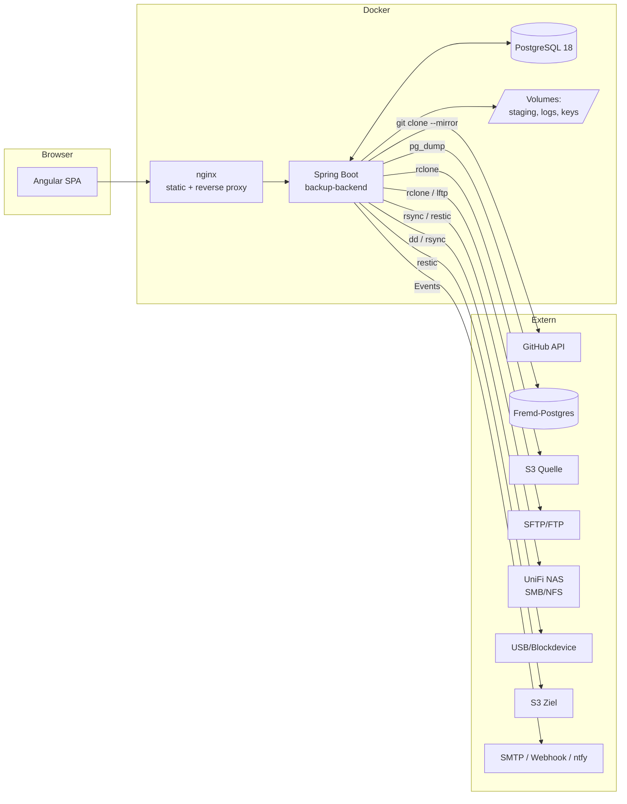
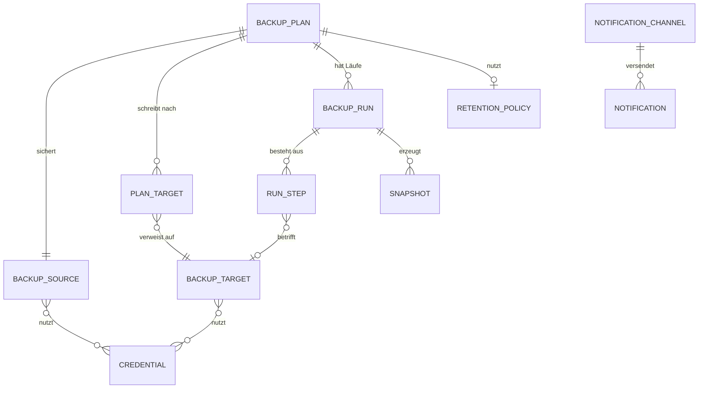

# Konzept: simple-backup

> Status: **Entwurf zur Abstimmung** · Stand: 2026-09-11
> Offene Entscheidungen sind in [§14](#14-offene-entscheidungen) gesammelt und mit `[E-n]` im Text markiert.

---

## 1. Ziel & Abgrenzung

Ein selbst gehostetes Web-Tool, mit dem Backups **zentral definiert, geplant, überwacht und wiederhergestellt** werden. Es erfindet keine eigene Backup-Technik, sondern **orchestriert erprobte Linux-Werkzeuge** (rsync, restic, rclone, pg_dump, git) und liefert das, was diesen Werkzeugen fehlt: Verwaltung, Zeitplanung, Historie, Statusübersicht, Alarmierung und ein Restore-Frontend.

**In Scope**

| Quellen (was gesichert wird) | Ziele (wohin) |
|---|---|
| GitHub-Repositories (inkl. Org/Privat) | Lokale Festplatte / Mount |
| S3-Buckets (AWS & S3-kompatibel) | UniFi NAS (SMB/NFS-Mount oder SFTP) |
| PostgreSQL-Datenbanken | S3 / S3-kompatibel (MinIO, Backblaze B2, Wasabi) |
| FTP / SFTP-Server | SFTP-Server |
| Lokale Ordner & NAS-Shares | |
| Blockdevices / ganze Festplatten | |

**Explizit nicht in Scope (v1)**

- Agent-Software auf den zu sichernden Maschinen (Pull-Modell statt Push-Agents).
- Bare-Metal-Restore von Blockdevices aus der UI heraus (nur Image-Erzeugung + dokumentierter manueller Restore).
- Mandantenfähigkeit / Rollen-Feingranularität `[E-3]`.

**Nicht-funktionale Leitplanken**

- Single-Node-Betrieb auf einem Homeserver muss mit <1 GB RAM für das Backend auskommen.
- Keine Datenverluste durch das Tool selbst: Löschoperationen (Retention/Prune) sind gesondert abgesichert.
- Jedes Backup ist ohne dieses Tool wiederherstellbar. **Kein proprietäres Format, kein Lock-in.** Ein `restic restore` von der Kommandozeile muss immer reichen.

---

## 2. Leitentscheidungen

### 2.1 Zwei-Stufen-Pipeline statt "alles mit rsync"

Der wichtigste Architekturpunkt. `rsync` ist ein exzellenter Datei-Spiegel, aber es kann drei Dinge nicht, die ein Backup-Tool braucht: **Versionierung** (Stand von vor 3 Wochen), **Deduplizierung** und **Verschlüsselung am Ziel**. Und es spricht kein S3.

Deshalb trennen wir **Beschaffung** von **Ablage**:

```
┌──────────────┐        ┌─────────────┐        ┌──────────────┐
│  PRODUCER    │        │   STAGING   │        │   STORAGE    │
│ quellspezif. │ ─────► │  (optional) │ ─────► │  ENGINE      │ ──► Ziel
└──────────────┘        └─────────────┘        └──────────────┘
 pg_dump                 tmpfs / Volume         restic  (Standard)
 git clone --mirror      oder direkt per Pipe   rsync   (Spiegel-Modus)
 rclone (S3/FTP/SFTP)                           rclone  (Sync-Modus)
 rsync / tar
 dd | zstd
```

**Storage-Engine der Wahl: `restic`** `[E-1]`

| Kriterium | restic | borg | rsync | rclone |
|---|---|---|---|---|
| S3-Ziel nativ | **ja** | nein (nur via rclone-Umweg) | nein | ja |
| Deduplizierung | **ja** (inhaltsbasiert) | ja | nein | nein |
| Verschlüsselung at rest | **ja** (AES-256, immer) | ja | nein | ja (crypt-remote) |
| Versionierung / Snapshots | **ja** | ja | nein | nein |
| Retention (GFS) eingebaut | **ja** (`forget --keep-*`) | ja | nein | nein |
| Integritätsprüfung | **ja** (`check --read-data`) | ja | nein | nein |
| Software am Ziel nötig | **nein** | ja (borg-Binary) | ja (rsync) | nein |
| Backup aus einer Pipe | **ja** (`--stdin`) | ja | nein | nein |

`restic` gewinnt vor allem an zwei Stellen: S3 direkt (Anforderung „S3 Target") und keine Software auf dem NAS nötig — ein UniFi NAS lässt sich nicht einfach mit einem borg-Binary bestücken.

**`rsync` bleibt** als zweiter, gleichberechtigter Engine-Modus für den Fall „ich will eine 1:1-Kopie, die ich ohne jedes Werkzeug im Dateimanager durchklicken kann" — typisch für den NAS-Ordner oder die USB-Platte im Schrank. Diese Kopie ist unverschlüsselt und unversioniert, und genau das ist manchmal gewollt.

> **Empfehlung:** Beide anbieten, `restic` als Default. Pro Ziel wird der Modus gewählt: `RESTIC` (versioniert, verschlüsselt, dedupliziert) oder `MIRROR` (rsync/rclone, 1:1, lesbar).

### 2.2 Ein Plan, mehrere Ziele (3-2-1-Regel)

Ein Backup auf genau ein Ziel ist kein Backup. Das Datenmodell bildet deshalb **1 Quelle → N Ziele** ab: Die Quelle wird einmal beschafft, das Ergebnis auf alle konfigurierten Ziele geschrieben. Ein Lauf gilt als `PARTIAL`, wenn das NAS erreichbar war, S3 aber nicht — mit gezielter Alarmierung nur für das fehlgeschlagene Ziel.

### 2.3 Externe Prozesse, nie eine Shell

Alle CLI-Aufrufe laufen über `ProcessBuilder` mit **Argumentliste**, niemals über `sh -c`. Nutzer-Eingaben (Pfade, Hostnamen, Bucket-Namen) landen als einzelne Argumente im Prozess und werden zusätzlich gegen eine Allowlist validiert. Das eliminiert Command-Injection als Angriffsklasse, bevor sie entsteht — bei einem Tool, das per Definition privilegierte Systembefehle ausführt, ist das nicht verhandelbar.

Secrets gehen **nie** als Kommandozeilen-Argument (in `ps` für jeden lesbar), sondern über Umgebungsvariablen des Kindprozesses, `stdin` oder temporäre Dateien mit Modus `0600`.

### 2.4 Modularer Monolith

Ein Deployable, aber innen mit klaren Modulgrenzen (`plan`, `run`, `engine`, `source`, `target`, `secret`, `notification`, `schedule`). Durchgesetzt per **Spring Modulith** — die Modulgrenzen sind dann testbar, nicht nur gut gemeint. Microservices wären für diese Last reine Betriebslast ohne Gegenwert.

---

## 3. Systemarchitektur



### 3.1 Backend-Module

| Modul | Verantwortung |
|---|---|
| `plan` | Backup-Pläne: Quelle, Ziele, Zeitplan, Retention, Aktivierung |
| `source` | Quell-Adapter (GitHub, Postgres, S3, SFTP, Pfad, Blockdevice) + Verbindungstest |
| `target` | Ziel-Adapter + Erreichbarkeits-/Speicherplatzprüfung |
| `engine` | Prozessausführung: ProcessBuilder, Streaming von stdout/stderr, Timeout, Abbruch, Exit-Code-Interpretation |
| `schedule` | Fällige Pläne finden, Nebenläufigkeit begrenzen, Läufe anstoßen |
| `run` | Lauf-Historie, Schritte, Metriken, Logs, Live-Stream (SSE) |
| `retention` | GFS-Regeln anwenden, Prune, Integritätschecks |
| `restore` | Snapshots browsen, Restore-Aufträge, Restore-Tests |
| `secret` | Verschlüsselte Ablage von Zugangsdaten |
| `notification` | Ereignis → Kanal (SMTP, Webhook, ntfy, Telegram), Dead-Man-Switch |
| `security` | Authentifizierung, Sessions, Audit-Log |

---

## 4. Domänenmodell



**`BackupPlan`** — `name`, `sourceId`, `targets[]`, `cronExpression`, `timezone`, `retentionPolicyId`, `enabled`, `timeoutMinutes`, `maxConcurrent`, `preHook`/`postHook` `[E-4]`, `notifyOn` (`FAILURE` | `ALWAYS` | `NEVER`)

**`BackupSource`** — `type` (Enum), `displayName`, typspezifische Konfiguration als validiertes JSONB, `credentialIds`. JSONB statt Tabelle pro Typ: neue Quelltypen kommen ohne Migration dazu, die Validierung sitzt im Java-Record pro Typ (`@JsonTypeInfo`-Polymorphie, Bean Validation).

**`BackupRun`** — `planId`, `trigger` (`SCHEDULE` | `MANUAL` | `RETRY` | `API`), `status` (`QUEUED` | `RUNNING` | `SUCCESS` | `PARTIAL` | `FAILED` | `CANCELLED` | `TIMEOUT`), `startedAt`, `finishedAt`, `bytesProcessed`, `bytesTransferred`, `filesNew/Changed/Unchanged`, `logPath`, `errorSummary`

**`RunStep`** — `kind` (`PREPARE` | `ACQUIRE` | `TRANSFER` | `VERIFY` | `PRUNE` | `CLEANUP`), `targetId?`, `status`, `exitCode`, `command` (Argumente, Secrets redigiert), Zeiten, Metriken. Die Aufspaltung in Schritte ist das, was `PARTIAL` überhaupt erst darstellbar macht und in der UI sofort zeigt, *wo* es hakte.

**`Snapshot`** — `runId`, `targetId`, `externalId` (restic-Snapshot-ID), `sizeBytes`, `createdAt`, `retentionTag` (`DAILY`/`WEEKLY`/`MONTHLY`/`YEARLY`/`PINNED`). `PINNED` = von Retention ausgenommen, z.B. der Stand vor einer Migration.

---

## 5. Die Quell-Adapter im Detail

### 5.1 Lokale Ordner / NAS-Mounts
- **Producer:** keiner — direkter Pfad.
- **Engine:** `restic backup <pfad> --exclude-file=...` oder `rsync -aHAX --delete`.
- **Hinweis:** Der UniFi-NAS-Share wird auf dem **Host** gemountet (CIFS/NFS) und als Volume in den Container gereicht. Mounten *im* Container bräuchte `CAP_SYS_ADMIN` — vermeidbar, also vermeiden.

### 5.2 PostgreSQL
- **Producer:** `pg_dump -Fc` pro Datenbank + `pg_dumpall --globals-only` für Rollen und Tablespaces (wird gern vergessen und fehlt dann beim Restore).
- **Pipeline:** `pg_dump ... | restic backup --stdin --stdin-filename db.dump` — kein Staging-Plattenplatz nötig, restic dedupliziert trotzdem chunk-basiert.
- **Stolperstein:** `pg_dump` muss **mindestens so neu sein wie der Server**. Bei mehreren Ziel-Servern mit verschiedenen Major-Versionen braucht es mehrere Client-Versionen — Hauptargument für das Sidecar-Runner-Modell `[E-2]`.
- **Verifikation:** `pg_restore --list` auf dem Dump; schlägt das fehl, ist der Dump korrupt und der Lauf `FAILED`, auch wenn `pg_dump` Exit 0 lieferte.
- **Optional später:** `pg_basebackup` + WAL-Archivierung für Point-in-Time-Recovery.

### 5.3 GitHub
- **Producer:** GitHub-API listet Repos (User, Orgs, Filter nach Topic/Sichtbarkeit/Archiv-Status), dann `git clone --mirror` bzw. `git remote update --prune` in einen persistenten Cache und `git bundle create --all` als Artefakt.
- **Wichtig zu wissen:** Ein Git-Mirror sichert **Code, Branches, Tags, Historie** — aber **nicht** Issues, Pull Requests, Reviews, Releases-Assets, Wiki, Actions-Secrets oder Projektboards. Wer „mein GitHub sichern" sagt, meint meist auch diese Metadaten. Vorschlag: zusätzlicher Schritt, der Issues/PRs/Releases über die REST-API als JSON ablegt (+ Wiki als eigenes Git-Repo, das ist es technisch). `[E-4]`
- **Rate-Limits:** 5000 req/h authentifiziert; Repo-Discovery wird gecacht, `git`-Operationen zählen nicht gegen das API-Limit.

### 5.4 S3-Buckets
- **Producer:** `rclone sync` in ein Staging-Verzeichnis (oder `rclone copy` direkt zum Ziel im `MIRROR`-Modus).
- **Kostenfalle:** Jeder vollständige Sync liest den Bucket — bei Glacier/Deep-Archive-Klassen teuer und langsam. Default: `--fast-list`, Vergleich über Größe+ModTime statt Checksumme, Speicherklassen-Filter konfigurierbar.
- **Versionierte Buckets:** rclone sichert nur die aktuelle Version. Das muss in der UI stehen, nicht im Kleingedruckten.

### 5.5 FTP / SFTP
- **Producer:** `rclone sync sftp:...` (bevorzugt, einheitliche Konfiguration) oder `lftp mirror` für FTP-Eigenheiten.
- **Sicherheit:** SSH-Hostkey wird beim Anlegen der Quelle erfasst und fest hinterlegt; `StrictHostKeyChecking=yes` gegen eine tool-eigene `known_hosts`. Kein `-o StrictHostKeyChecking=no`, nie.
- Reines FTP (unverschlüsselt) wird unterstützt, aber in der UI als unsicher markiert.

### 5.6 Blockdevices / ganze Festplatten
- **Producer:** `dd if=/dev/sdX bs=4M | zstd -T0` in eine Pipe → `restic backup --stdin`. Bei ext4/xfs besser `partclone`/`e2image` (überspringt freie Blöcke, drastisch kleiner und schneller).
- **Voraussetzung:** Das Device muss in den Container gereicht werden (`devices:` in Compose) — kein `privileged: true`. Das Dateisystem sollte ausgehängt oder read-only sein, sonst ist das Image inkonsistent.
- **Ehrliche Einordnung:** Image-Backups dedupliziert restic schlecht (ein verschobenes Byte verschiebt alle Chunks — teilweise entschärft durch restics inhaltsbasiertes Chunking, aber komprimierte Streams sind gar nicht dedupliziertbar). Für „ganze Platte regelmäßig" ist dateibasiertes Backup fast immer die bessere Antwort. Das Tool unterstützt beides und sagt das in der UI.

---

## 6. Ausführung: Wie kommen die Tools in den Container?

`[E-2]` — **die zweite große Entscheidung.**

**Variante A — Fat Image (alles im Backend-Container)**
`+` einfach, ein Container, keine Docker-Socket-Freigabe, schnellster Weg zum ersten funktionierenden Backup
`−` großes Image (~600 MB), genau eine `pg_dump`-Version, Tool-Update = Backend-Neustart

**Variante B — Sidecar-Runner (Backend startet Container über den Docker-Socket)**
`+` `pg_dump` in passender Major-Version pro Job, saubere Ressourcen-/Netz-Isolation je Lauf, Tools unabhängig vom Backend aktualisierbar
`−` Docker-Socket im Container ist root-äquivalent auf dem Host, deutlich mehr bewegliche Teile

**Variante C — Kubernetes Jobs** — richtig für den Cluster-Betrieb, Overkill für einen Homeserver.

> **Empfehlung:** **A für v1, aber hinter einer `BackupExecutor`-Schnittstelle** (`LocalProcessExecutor` / später `DockerJobExecutor`). Der Wechsel ist dann eine Implementierung, keine Umbaumaßnahme. Das Image bringt `restic`, `rsync`, `rclone`, `git`, `openssh-client`, `zstd` und `postgresql-client-18` mit; bei Bedarf für ältere Server zusätzlich `postgresql-client-16/17` aus dem PGDG-Repo — die Binaries liegen versionsspezifisch unter `/usr/lib/postgresql/<major>/bin/`, der passende Pfad wird pro Job gewählt.

### 6.1 Scheduling

Kein Quartz. Stattdessen ein **Datenbank-Poller**: alle 30 s prüft ein `@Scheduled`-Task, welche Pläne fällig sind, und übernimmt sie mit

```sql
SELECT ... FROM backup_plan WHERE next_run_at <= now() AND enabled
FOR UPDATE SKIP LOCKED LIMIT 10
```

Das ist mehrinstanzen-sicher, überlebt Neustarts, braucht keine zusätzliche Bibliothek und keine elf Quartz-Tabellen. Cron-Ausdrücke per `CronExpression` aus Spring, Zeitzone pro Plan (Sommerzeit korrekt). Verpasste Läufe (Server war aus): konfigurierbar `SKIP` (Default) oder `CATCH_UP`.

Begrenzung der Nebenläufigkeit: global (`maxParallelRuns`, Default 2), pro Ziel (ein restic-Repository verträgt keine parallelen `prune`-Operationen) und pro Plan (nie zweimal gleichzeitig).

### 6.2 Lauf-Lebenszyklus

```
QUEUED → RUNNING → ┬→ SUCCESS      (alle Schritte ok)
                   ├→ PARTIAL      (≥1 Ziel ok, ≥1 Ziel fehlgeschlagen)
                   ├→ FAILED       (Beschaffung fehlgeschlagen oder alle Ziele down)
                   ├→ TIMEOUT      (Zeitlimit überschritten, Prozessgruppe beendet)
                   └→ CANCELLED    (Nutzerabbruch)
```

- **Live-Logs:** stdout/stderr werden zeilenweise gelesen, in `logs/{runId}.log` geschrieben und per **SSE** an die UI gestreamt. Logs gehören nicht in die Datenbank — nur Pfad und Kurzfassung des Fehlers.
- **Fortschritt:** `restic --json` liefert strukturierten Fortschritt (Prozent, Bytes, ETA), `rsync --info=progress2` ebenfalls — beides wird geparst und als Fortschrittsbalken angezeigt.
- **Abbruch:** `ProcessHandle.destroy()` auf die ganze Prozessgruppe, nach 10 s `destroyForcibly()`, danach Aufräumen von Staging und `restic unlock`.
- **Wiederanlauf:** Beim Start werden Läufe, die in `RUNNING` hängen (Absturz), auf `FAILED` gesetzt und ihre Sperren gelöst.
- **Retry:** exponentieller Backoff, konfigurierbar (Default 2 Versuche), nur bei als transient klassifizierten Fehlern (Netz, Timeout) — nicht bei Exit-Codes, die auf Fehlkonfiguration deuten.

---

## 7. Aufbewahrung, Prüfung, Wiederherstellung

### 7.1 Retention (GFS)
`restic forget --keep-last N --keep-daily 7 --keep-weekly 4 --keep-monthly 12 --keep-yearly 3 --prune`

Zwei Schutzmechanismen gegen Datenverlust durch das Tool selbst:
1. **Dry-Run-Pflicht bei Änderungen:** Wird eine Retention-Regel verschärft, zeigt die UI vorher, welche Snapshots das löschen würde — und verlangt eine Bestätigung.
2. **Prune läuft getrennt vom Backup.** Ein Backup, das am Prune scheitert, hat trotzdem gesichert. Prune ist ein eigener, seltener Lauf (z.B. wöchentlich).

### 7.2 Integritätsprüfung
Ein ungeprüftes Backup ist eine Vermutung. Als eigener Plantyp:
- `restic check` (Struktur, schnell) — wöchentlich
- `restic check --read-data-subset=5%` (echte Daten, liest 5 % zufällig) — monatlich
- **Restore-Test:** Stichprobe automatisch in ein Temp-Verzeichnis wiederherstellen, Prüfsummen vergleichen, wieder verwerfen. Ergebnis als grünes/rotes Abzeichen am Ziel. Das ist das Feature, das im Ernstfall den Unterschied macht.

### 7.3 Restore
- Snapshots pro Ziel browsen (`restic snapshots --json`, Dateibaum via `restic ls`).
- Restore in einen wählbaren Zielpfad, optional nur einzelne Pfade.
- Einzelne Datei direkt im Browser herunterladen (gestreamt via `restic dump`).
- Postgres: Dump herunterladen **oder** geführter Restore in eine Ziel-DB (mit doppelter Bestätigung und Pflichtfeld „Zieldatenbank" — versehentliches Überschreiben der Produktion muss schwer sein).
- Restore-Läufe landen in derselben Historie und werden auditiert.

---

## 8. Status & Benachrichtigung

### 8.1 Dashboard
- Kachel je Plan: letzter Lauf (Ampel), Dauer, Größe, nächster Lauf, Sparkline der letzten 30 Läufe.
- Globale Ampel oben: „alles grün" / „N Pläne rot" / „N überfällig".
- Speicherbelegung je Ziel inkl. Trend — freier Platz ist der Grund Nr. 1 für plötzlich fehlschlagende Backups.

### 8.2 Kanäle
SMTP (E-Mail), generischer Webhook (JSON, für n8n/Home Assistant/Gotify), **ntfy** (Push aufs Handy, selbst hostbar), Telegram, Slack/Discord. Ein Kanal-Interface, Implementierungen austauschbar.

Auslöser: `RUN_FAILED`, `RUN_PARTIAL`, `RUN_SUCCESS` (optional), `PLAN_OVERDUE`, `TARGET_UNREACHABLE`, `STORAGE_LOW`, `VERIFY_FAILED`, `RETENTION_WOULD_DELETE_ALL`.

**Zustellung robust:** Benachrichtigungen laufen über eine Outbox-Tabelle mit Wiederholung. Eine Alarmmeldung, die selbst verloren geht, ist schlimmer als keine.

**Anti-Spam:** Wiederholte Fehler desselben Plans werden zusammengefasst (erster Fehler sofort, danach gedrosselt), plus eine Meldung beim Wiedererholen („Plan X läuft wieder").

### 8.3 Dead-Man-Switch — das wichtigste Monitoring-Feature

Der gefährlichste Zustand ist nicht das fehlgeschlagene Backup, sondern das **ausgebliebene**: Container tot, Host aus, Scheduler hängt — und es kommt nie eine Fehlermeldung, weil nichts läuft, das eine senden könnte.

Zwei Ebenen:
1. **Intern:** Ein Wächter prüft, ob jeder Plan innerhalb `erwartetes Intervall × 1,5` gelaufen ist, und schlägt sonst Alarm (`PLAN_OVERDUE`).
2. **Extern:** Das Tool pingt nach jedem erfolgreichen Lauf einen externen Dienst (healthchecks.io oder selbst gehostet). Bleibt der Ping aus, alarmiert **der** — auch wenn dieses Tool komplett tot ist. Optional, aber dringend empfohlen.

### 8.4 Metriken
Micrometer → `/actuator/prometheus`: Lauf-Dauer, Erfolgsquote, Bytes, Alter des jüngsten Snapshots pro Plan, Zielbelegung. Wer Grafana hat, hat sofort Dashboards und Alerting.

---

## 9. Sicherheit

### 9.1 Zugangsdaten
Zu schützen: GitHub-PATs, S3-Keys, SSH-Keys, DB-Passwörter, restic-Repository-Passwörter, SMTP-Zugänge.

- **Verschlüsselung:** AES-256-GCM pro Datensatz mit Envelope-Verfahren; Masterkey aus Umgebungsvariable bzw. Docker Secret, **nie in der Datenbank**. Schlüsselrotation über `keyVersion` je Datensatz.
- **API:** Secret-Felder sind schreib-only. Die API gibt nie einen Klartextwert zurück, auch nicht an Admins.
- **Logs:** Ein zentraler Redaktor filtert bekannte Secret-Werte und typische Muster (`ghp_…`, `AKIA…`) aus allen Logzeilen und gespeicherten Kommandos, bevor sie geschrieben werden.
- **Backup des Tools selbst:** Ohne Masterkey ist die eigene Datenbank wertlos. Ein geführter „Konfiguration exportieren"-Ablauf (passwortgeschütztes Archiv) gehört ins v1 — sonst ist der erste echte Ernstfall zugleich der letzte.

### 9.2 Authentifizierung `[E-3]`
- **Empfehlung v1:** Spring Security mit **Session-Cookie** (`HttpOnly`, `Secure`, `SameSite=Lax`) statt JWT im LocalStorage. Weniger Code, kein XSS-Token-Diebstahl, sofortiger Logout möglich. JWT löst hier ein Problem, das niemand hat.
- Passwort-Hash Argon2id, Brute-Force-Bremse, Pflicht-Passwortwechsel beim ersten Login.
- TOTP-2FA als kleines, lohnendes Extra.
- **Später:** OIDC (Authelia/Keycloak/Authentik) — im Homelab-Umfeld häufig vorhanden.
- Rollen v1: `ADMIN` (alles) und `VIEWER` (nur lesen). Mehr erst, wenn jemand mehr braucht.

### 9.3 Härtung
- Container läuft als Nicht-Root; Root nur, wo Blockdevice-Zugriff es zwingend verlangt (dann sauber begrenzt über `devices:`, nie `privileged`).
- Quell-Mounts read-only (`:ro`) — das Tool hat auf den Quelldaten nichts zu schreiben.
- Audit-Log für jede verändernde Aktion (wer, was, wann, von wo).
- Keine Ausgabe nach außen ohne Kontext: Fehlermeldungen an die UI sind bereinigt, Details stehen im Log.

---

## 10. Technologie-Stack (verifiziert, Stand 2026-09-11)

### Backend
| Baustein | Version | Begründung |
|---|---|---|
| Java | **25 (LTS)** | aktuelles LTS, virtuelle Threads ohne Pinning |
| Spring Boot | **4.1.1** | aktuelles Release (Spring Framework 7) |
| PostgreSQL | **18** | JSONB für Adapter-Konfiguration, `SKIP LOCKED` für den Scheduler |
| Flyway | aktuell | versionierte Migrationen ab Commit 1 |
| Spring Modulith | aktuell | Modulgrenzen testbar statt nur dokumentiert |
| springdoc-openapi | aktuell | OpenAPI-Spec → generierter Angular-Client |
| Micrometer | mitgeliefert | Prometheus-Metriken |
| Testcontainers | aktuell | Integrationstests gegen echtes Postgres/MinIO/SFTP |

Virtuelle Threads passen hier ausgesprochen gut: Ein Backup-Lauf ist zu 99 % Warten auf einen Kindprozess. Ein Thread pro Lauf ist das einfachste Modell — mit virtuellen Threads ist es auch das billigste, kein Reactive-Programmiermodell nötig.

### Frontend
| Baustein | Version | Begründung |
|---|---|---|
| Angular | **22.1** (oder **21.2 LTS** `[E-5]`) | Standalone Components, Signals, `@if`/`@for`, Zoneless |
| TypeScript | passend zum Angular-Release | `strict` von Anfang an |
| UI-Bibliothek | Angular Material **oder** PrimeNG `[E-5]` | Material: schlank, Standard; PrimeNG: viel mehr fertige Tabellen/Trees |
| State | Signals + Services | NgRx wäre für diese Größe Overhead |
| API-Client | aus OpenAPI generiert | keine handgeschriebenen DTOs, Brüche fallen beim Build auf |
| Tests | Vitest + Playwright | |

### Build & CI
- **Gradle (Kotlin DSL)** für das Backend `[E-5]`, Angular-Build als eigener Schritt, im Release-Image zusammengefügt.
- GitHub Actions: Build → Test → Lint → Container-Scan (Trivy) → Multi-Arch-Image (amd64 **und arm64**, falls das Ziel ein Raspberry Pi oder eine ARM-NAS ist) nach GHCR.
- Conventional Commits + automatisches Changelog.

---

## 11. Deployment

```yaml
# compose.yaml (Auszug, konzeptionell)
services:
  db:
    image: postgres:18-alpine
    healthcheck: { test: ["CMD-SHELL", "pg_isready -U backup"] }
    volumes: [ "dbdata:/var/lib/postgresql/data" ]

  backend:
    image: ghcr.io/remoraschle/simple-backup:latest
    depends_on: { db: { condition: service_healthy } }
    environment:
      SIMPLEBACKUP_MASTER_KEY_FILE: /run/secrets/master_key
    secrets: [ master_key ]
    volumes:
      - "staging:/var/lib/simple-backup/staging"
      - "logs:/var/lib/simple-backup/logs"
      - "/mnt/nas:/mnt/nas"            # NAS-Share, auf dem Host gemountet
      - "/srv/photos:/sources/photos:ro"  # Quelle read-only
    # devices: [ "/dev/sdb:/dev/sdb" ]  # nur bei Blockdevice-Backups

  web:
    image: ghcr.io/remoraschle/simple-backup-web:latest   # nginx + SPA
    ports: [ "8080:80" ]
```

Dazu eine `compose.dev.yaml` mit Postgres, MinIO (S3-Ziel zum Testen), einem SFTP-Container und Mailpit (SMTP-Attrappe) — damit ist die komplette Matrix lokal testbar, ohne echte Zugangsdaten.

TLS und Zugang von außen übernimmt ein vorgelagerter Reverse Proxy (Traefik/Caddy/NPM) — das Tool bringt kein eigenes ACME mit. `[E-5]`

---

## 12. Projektstruktur

```
simple-backup/
├── backend/
│   ├── src/main/java/dev/remo/simplebackup/
│   │   ├── plan/  source/  target/  engine/  schedule/
│   │   ├── run/   retention/  restore/  secret/
│   │   ├── notification/  security/  shared/
│   │   └── SimpleBackupApplication.java
│   └── src/main/resources/db/migration/    # Flyway
├── frontend/
│   └── src/app/{core,shared,features/{dashboard,plans,sources,targets,runs,restore,settings}}
├── docker/{backend.Dockerfile,web.Dockerfile,runner.Dockerfile}
├── compose.yaml · compose.dev.yaml
├── docs/{konzept.md, adr/, betrieb.md, restore-runbook.md}
└── .github/workflows/
```

`docs/restore-runbook.md` ist bewusst gelistet: die Anleitung, wie man **ohne dieses Tool** an die Daten kommt. Wenn die Bude brennt, läuft kein Spring Boot mehr.

---

## 13. Roadmap

| Meilenstein | Inhalt | Ergebnis |
|---|---|---|
| **M0 — Gerüst** | Repo, Gradle/Angular-Skelett, Compose, CI, Flyway, Auth, Health | Es läuft, es ist leer |
| **M1 — Erstes echtes Backup** | Quelle „lokaler Pfad", Ziel „lokal + S3", restic-Engine, Scheduler, Lauf-Historie, Dashboard | Ordner → S3, geplant, sichtbar |
| **M2 — Vertrauen** | Benachrichtigungen (SMTP + Webhook + ntfy), Retention/GFS, Dead-Man-Switch, Live-Logs | Man erfährt, wenn es kaputt ist |
| **M3 — Wiederherstellung** | Snapshot-Browser, Restore, Datei-Download, `restic check`, Restore-Test | Backups sind nachweislich gut |
| **M4 — Postgres & GitHub** | pg_dump-Pipeline, Globals, Dump-Verifikation, GitHub-Discovery + Mirror + Metadaten | Die beiden wertvollsten Quellen |
| **M5 — S3, SFTP, NAS, rsync-Modus** | rclone-Adapter, Hostkey-Handling, Mirror-Modus | Quellmatrix vollständig |
| **M6 — Kür** | Blockdevices, Prometheus, OIDC, Multi-Version-Runner, Konfig-Export/Import | Betriebsreif |

M1–M3 zuerst und in dieser Reihenfolge ist Absicht: Lieber **eine** Quelle, die zuverlässig sichert, überwacht *und* nachweislich wiederherstellbar ist, als sechs Quellen, bei denen niemand weiß, ob ein Restore je funktioniert hat.

---

## 14. Offene Entscheidungen

| # | Frage | Optionen | Empfehlung |
|---|---|---|---|
| **E-1** | Storage-Engine | restic / borg / nur rsync / restic+rsync | **restic als Default, rsync als Mirror-Modus** |
| **E-2** | Ausführungsmodell | Fat Image / Docker-Sidecar-Runner / K8s Jobs | **Fat Image hinter `BackupExecutor`-Interface** |
| **E-3** | Nutzer & Auth | Single-User / Multi-User+Rollen / OIDC ab v1 | **Single-Admin + VIEWER, Session-Cookie; OIDC später** |
| **E-4** | Umfang v1 | Nur Dateien+DB / plus GitHub-Metadaten / plus Pre-/Post-Hooks | GitHub-Metadaten ja, Hooks erst nach Sicherheitskonzept |
| **E-5** | Werkzeugwahl | Gradle vs. Maven · Angular 22 vs. 21 LTS · Material vs. PrimeNG | **Gradle · Angular 22 · PrimeNG** (mehr fertige Tabellen/Trees) |

---

## 15. Bekannte Risiken

| Risiko | Gegenmaßnahme |
|---|---|
| Das Tool löscht durch fehlerhafte Retention gute Backups | Dry-Run mit Bestätigung, Prune getrennt vom Backup, `PINNED`-Snapshots, „würde alles löschen"-Alarm |
| Masterkey verloren → alle Zugangsdaten weg | Geführter Konfig-Export, Key im Passwortmanager, im Runbook dokumentiert |
| Backups laufen jahrelang und sind nicht wiederherstellbar | Automatische Restore-Tests als Pflichtfeature, nicht als Option |
| Ausfall bleibt unbemerkt | Dead-Man-Switch intern **und** extern |
| Command-Injection über Konfigurationsfelder | `ProcessBuilder` mit Argumentliste, keine Shell, Eingabe-Allowlist |
| `pg_dump`-Versionskonflikt | Mehrere Client-Versionen im Image, Versionsprüfung beim Verbindungstest |
| Volllaufendes Staging-Volume | Vorab-Größenschätzung, Speicherplatzprüfung vor dem Lauf, Streaming statt Staging wo möglich |
